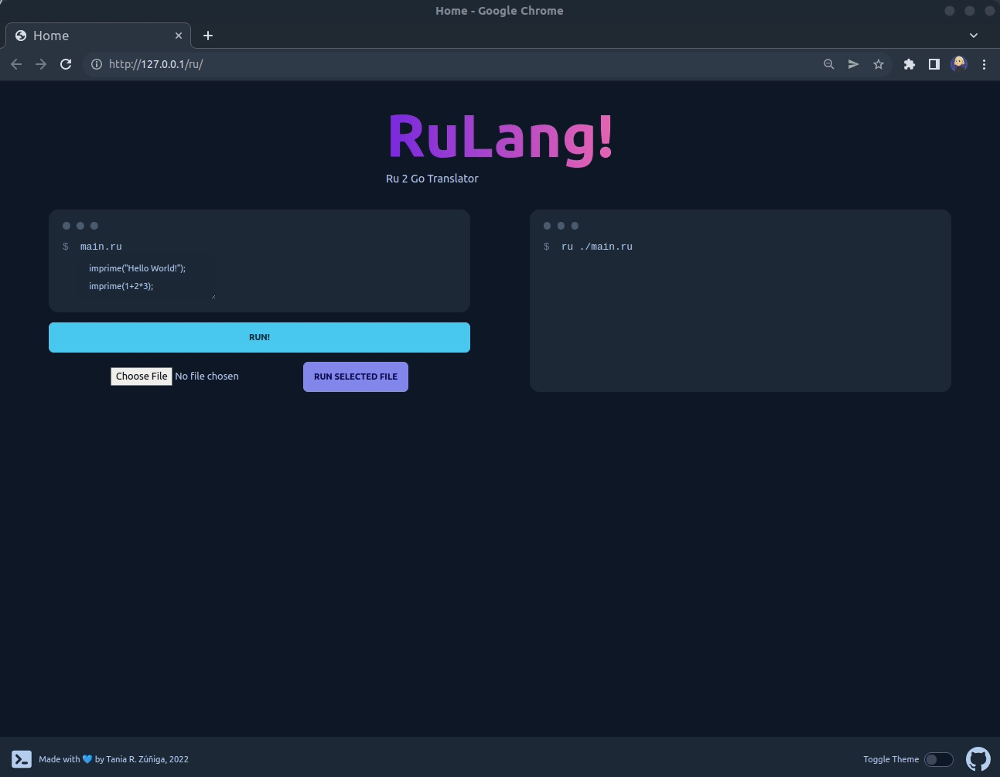
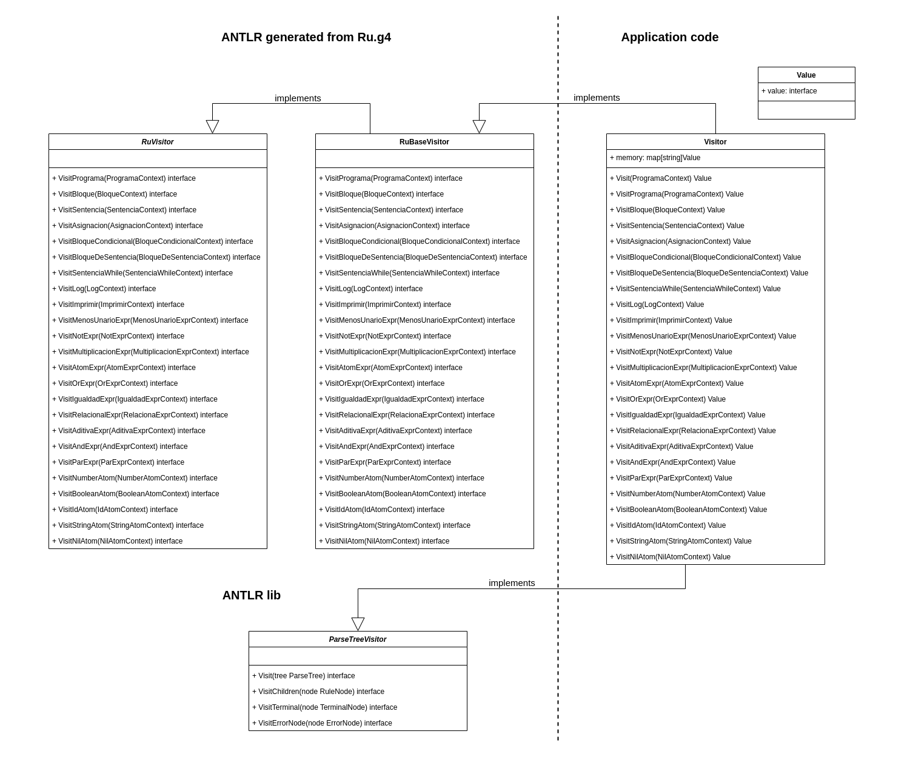
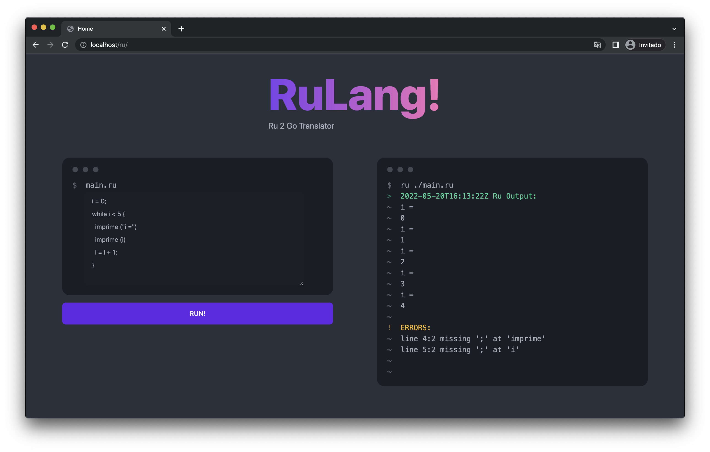
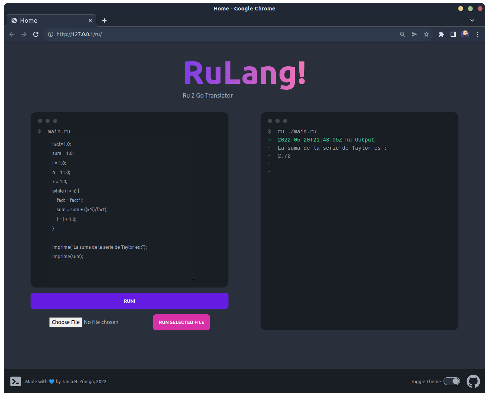

# Ru2Go Translator


>🧡 **Universidad Autónoma Metropolitana** 🧡
> 
> By Tania R. Zúñiga 👩🏼‍💻
> 
> Guidance Dr. Roberto Bernal Jaquez 🔎


Proyecto final para la materia Traductores - Trimestre 22 Invierno ⛄

TL;DR Traductor de RuLang escrito en GoLang. 🐹



## Index

1. [🔨 Implementación](https://github.com/TanZng/RuLang2GoLang#-implementaci%C3%B3n)
2. [👓 Grammar](https://github.com/TanZng/RuLang2GoLang#-grammar)
3. [🖼 Ejemplos de ejecución](https://github.com/TanZng/RuLang2GoLang#-ejemplos-de-ejecuci%C3%B3n)
4. [🚀 Run](https://github.com/TanZng/RuLang2GoLang#-run)
5. [💻 Development](https://github.com/TanZng/RuLang2GoLang#-run)


## 🔨 Implementación

Los programas que reconocen lenguajes se denominan analizadores sintácticos o analizadores de sintaxis. La sintaxis se refiere a las reglas que gobiernan la pertenencia del lenguaje. Por otro lado, una gramática (_grammar_) es solo un conjunto de reglas, cada una de las cuales expresa la estructura de una frase.

Ademas, el proceso de agrupar caracteres en palabras o símbolos (tokens) se denomina análisis léxico o simplemente tokenización.

Llamamos _Lexer_ a un programa que tokeniza la entrada. El lexer puede agrupar tokens relacionados en clases de tokens o tipos de tokens. El analizador real y se alimenta de esos tokens para reconocer la estructura de la oración.

Un árbol de análisis o árbol de sintaxis, registra cómo el analizador reconoció la estructura de la oración de entrada y las frases que la componen. Los nodos interiores del árbol corresponden a nombres de frases que agrupan e identifican a sus hijos.

El árbol de sintaxis, es una estructura de datos útil para el resto de la aplicación, pues contiene la información de cómo el analizador agrupó los símbolos en frases.

La herramienta ANTLR genera analizadores de descenso recursivo (LL) a partir de reglas gramaticales.

Los objetos de contexto registran todo lo que sabemos sobre el reconocimiento de una frase por una regla. Cada objeto de contexto conoce los tokens de inicio y final de la frase reconocida, y proporciona acceso a todos los elementos de esa frase.

En este caso queremos controlar el paseo en sí mismo, llamando explícitamente a métodos para visitar a los nodos hijos. ANTLR genera una interfaz `Visitor`, a partir de una gramática, está contiene un método de visita por regla.

Aquí está el patrón familiar de visitantes que opera en nuestro árbol de análisis:


La línea punteada azul muestra un paseo en profundidad del árbol de análisis.

Las líneas punteada rojas indican la secuencia de llamada de los métodos del visitante.

Para iniciar un paseo por el árbol, el código de nuestra aplicación creará una implementación de visitante y llamaría al metodo `visit`.

```java
ParseTree tree = ... ; // tree is result of parsing
MyVisitor v = new MyVisitor();
v.visit(tree);
```

En el diagrama, el código para visitors de ANTLR llama a `visitSentencia` al ver el nodo raíz. A partir de ahí, la implementación de `visitSentencia` llama `visit` con los nodo hijo como argumentos para continuar la caminata. O bien, `visitMethod` podría llamar explícitamente a `visitAsignacion`, y así sucesivamente.

ANTLR nos da una ventaja de generar la interfaz de visitante y proporcionar una clase con implementaciones predeterminadas para los métodos de visitante. De esta manera, evitamos tener que sobreescribir todos los métodos en la interfaz, permitiéndonos centrarnos solo en los métodos de interés.

Los Vistors recorren el árboles de análisis llamando al método de `visit` de la interfaz `ParseTreeVisitor` en los nodos hijos.



La clase/struct Visitor implementa la interfaz RuVisitor, se compone de una "memoria" y un tipo RuVisitor.

La memoria es un `map` almacena valores de la forma {llave: valor}, donde la llave almacena el nombre de la variable y el valor corresponde al valor de la misma.

La clase Visitor implementa los metodos que la interfaz RuVisitor requiere. Está clase tambien implementa el método Visito(tree) que recibe un antlr.ParseTree, sobre el cual se iniciará el recorrido.

El Visitor y el arbol a recorrer son instanciados en el método `Init(string)` en `translator/translator.go`. Este metodo es llamado por el servidor en `cmd/server/server.go` para que el código dado sea traducido y ejecutado cuando una petición le llega. Finalmente es el `main.go` inicia el servidor.

## 👓 Grammar

Este Traductor consta de un analizador léxico, un analizador sintáctico, y
reconocer y ejecutar lo siguiente:

Sentencias
- [x] Asignacion
- [x] If
- [x] While
- [x] Log/Logger
- [x] Imprimir
- [x] Bloque Condicional
- [x] Bloque De Sentencia

Expresiones
- [x] MenosUnarioExpr
- [x] Not (`!`)
- [x] multiplicacionExpr
- [x] aditivaExpr
- [x] relacionalExpr
- [x] igualdadExpr
- [x] andExpr
- [x] orExpr
- [x] atomExpr

Atomos
- [x] parExpr `()`
- [x] numberAtom
- [x] booleanAtom
- [x] idAtom
- [x] stringAtom
- [x] nilAtom

Además maneja errores:
- Las operaciones solo pueden ser entre elementos del mismo tipo.
- El modulo (`%`) no se puede realizar en con FLOATs.
- Llamar variables que no fueron declaradas.
- Punto y coma (`;`) faltante.

### 🖼 Ejemplos de ejecución





## 🚀 Run

Ejecute con:

```bash
$ docker-compose -f docker-compose-production.yaml build
$ docker-compose -f docker-compose-production.yaml up
# output
# Creating rulang2golang_goservice_1 ... done
# Creating rulang2golang_nginx_1     ... done
# Attaching to rulang2golang_goservice_1, rulang2golang_nginx_1
# ...
# nginx_1      | /docker-entrypoint.sh: Configuration complete; ready for start up
# goservice_1  | 2022/05/19 16:40:26 stdout: 🚀 Serving at  http://localhost/ru/
```

**Open http://localhost/ru/ . Enjoy!**

o de forma local (se requiere Go 1.18+):

```bash
$ go build -o ./out/webapp
$ ./out/webapp
# output
# 🚀 Serving at  http://127.0.0.1:5555
```

**Open http://127.0.0.1:5555 . Enjoy!**

Cargue alguno de los ejemplos `test*.ru` o copie y pegue uno de los siguientes ejemplos:

```go
c = 3.0;
b = -1.0;
a = true;
imprime(b);
while b <= c {
    b = b + 1.0;
}
if (0) {
    imprime("if");
}
else if (!("false" == "true")) {
    imprime("else if");
}
else {
    imprime("else");
}
imprime(b);
imprime("Adios");
```

```go
i = 0;
while i < 5 {
  imprime ("i =")
  imprime (i)
  i = i + 1;
}
```

```go
imprime("Hello World!");
```

To finish, run:
```bash
$ docker-compose down
```

## 💻 Development

### 🐋 Docker
```bash
$ docker-compose build
$ docker-compose up
# output
# go-api_1  | 2022/05/19 16:35:48 Running build command!
# go-api_1  | 2022/05/19 16:35:49 Build ok.
# go-api_1  | 2022/05/19 16:35:49 Restarting the given command.
# go-api_1  | 2022/05/19 16:35:49 stdout: 🚀 Serving at  http://127.0.0.1:5555
```

On http://127.0.0.1:5555 is the app. Happy coding!

To stop run
```bash
$ docker-compose down
```

### 💾 Local

You need Go 1.18+ install in your machine. Execute
```bash
$ go run .
# output
# 🚀 Serving at  http://127.0.0.1:5555
```
