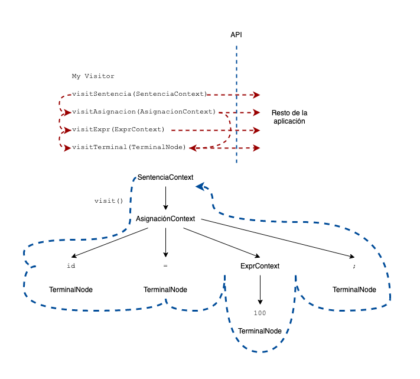

# Ru2Go Translator

🚧 WIP

Los programas que reconocen lenguajes se denominan analizadores sintácticos o analizadores de sintaxis.
La sintaxis se refiere a las reglas que gobiernan la pertenencia del lenguaje.

Por otro lado, una gramática (_grammar_) es solo un conjunto de reglas, cada una de las cuales expresa la estructura de una frase.

Ademas, el proceso de agrupar caracteres en palabras o símbolos (tokens) se denomina análisis léxico o simplemente tokenización.

Llamamos Lexer a un programa que tokeniza la entrada. El lexer puede agrupar tokens relacionados en clases de tokens o tipos de tokens.

La segunda etapa es el analizador real y se alimenta de esos tokens para reconocer la estructura de la oración.

Un árbol de análisis o árbol de sintaxis que registra cómo el analizador reconoció la estructura de la oración de entrada y sus frases componentes

Los nodos interiores del árbol de análisis son nombres de frases que agrupan e identifican a sus hijos.

El árbol de análisis, un analizador ofrece una estructura de datos útil para el resto de la aplicación que contiene información completa sobre cómo el analizador agrupó los símbolos en frases

La herramienta ANTLR genera analizadores de descenso recursivo a partir de reglas gramaticales

Lo bueno de los analizadores de descenso recursivo es que el gráfico de llamadas trazado mediante la invocación de los métodos stat, asigna y expr refleja los nodos del árbol de análisis interior.

token anticipado es cualquier token que el analizador detecta antes de compararlo y consumirlo

Estos se denominan objetos de contexto porque registran todo lo que sabemos sobre el reconocimiento de una frase por una regla.

Cada objeto de contexto conoce los tokens de inicio y finalización de la frase reconocida y proporciona acceso a todos los elementos de esa frase.
interfaz de oyente de árbol de análisis que responde a eventos activados por el caminante de árbol incorporado

Este Traductor consta de un analizador léxico, un analizador sintáctico, y
realizan las siguientes operaciones:

1. Suma
2. Resta
3. Multiplicación
4. División
5. And y Or
6. Igualdad
7. Desigualdad
8. Relacionales (<,>,<=,>=)
9. Logaritmo
10. Negación

Tambien es capaz de identificar las sentencias:
1. If
2. While
3. Asignación
4. Imprimir

Sin embargo, hay situaciones en las que queremos controlar el paseo en sí mismo, llamando explícitamente a métodos para visitar a los niños. 
ANTLR permite generar una interfaz de `Visitor` a partir de una gramática, está contiene un método de visita por regla.
Aquí está el patrón familiar de visitantes que opera en nuestro árbol de análisis:



La línea punteada azul muestra un paseo en profundidad del árbol de análisis.

Las líneas punteada rojas indican la secuencia de llamada de los métodos del visitante.

Para iniciar un paseo por el árbol, el código de nuestra aplicación creará una implementación de visitante y llamaría al metodo `visit`.

```java
ParseTree tree = ... ; // tree is result of parsing
MyVisitor v = new MyVisitor();
v.visit(tree);
```

Sobre la implementacion:

La clase/struct Visitor implementa la interfaz RuVisitor y se compone de una "memoria".

La memoria es un `map` almacena valores de la forma {llave: valor}, donde la llave almacena el nombre de la variable y el valor corresponde al valor de la misma.

La clase Visitor implementa los metodos que el RuVisitor requiere.
Está clase contiene un constructor Visitor(tree) que contiene un antlr.ParseTree.


## 🚀 Run

Run:

```bash
$ go run .
# output
# 🚀 Serving at  http://127.0.0.1:5555
```

**Open http://127.0.0.1:5555 . Enjoy!**

or

```bash
$ docker-compose -f docker-compose-production.yaml build
$ docker-compose -f docker-compose-production.yaml up
# output
# Creating rulang2golang_goservice_1 ... done
# Creating rulang2golang_nginx_1     ... done
# Attaching to rulang2golang_goservice_1, rulang2golang_nginx_1
# ...
# nginx_1      | /docker-entrypoint.sh: Configuration complete; ready for start up
# goservice_1  | 2022/05/19 16:40:26 stdout: 🚀 Serving at  http://localhost/ru/
```

**Open http://localhost/ru/ . Enjoy!**

test with this codes

```js
c = 3.0;
b = -1.0;
a = true;
imprime(b);
while b <= c {
    b = b + 1.0;
}
if (0) {
    imprime("if");
}
else if (!("false" == "true")) {
    imprime("else if");
}
else {
    imprime("else");
}
imprime(b);
imprime("Adios");
```

```js
i = 0;
while i < 5 {
  imprime ("i =")
  imprime (i)
  i = i + 1;
}
```

```js
imprime("Hello World!");
```

To stop run
```bash
$ docker-compose down
```

## 💻 Development

### 🐋 Docker
```bash
$ docker-compose build
$ docker-compose up
# output
# go-api_1  | 2022/05/19 16:35:48 Running build command!
# go-api_1  | 2022/05/19 16:35:49 Build ok.
# go-api_1  | 2022/05/19 16:35:49 Restarting the given command.
# go-api_1  | 2022/05/19 16:35:49 stdout: 🚀 Serving at  http://127.0.0.1:5555
```

On http://127.0.0.1:5555 is the app. Happy coding!

To stop run
```bash
$ docker-compose down
```

### 💾 Local

You need Go 1.18+ install in your machine. Execute
```bash
$ go run .
# output
# 🚀 Serving at  http://127.0.0.1:5555
```

## Grammar

Sentencias
- [x] Asignacion 
- [x] If
- [x] While
- [x] Log
- [x] Imprimir
- [x]   Bloque Condicional
- [x]   Bloque De Sentencia

Expresiones
- [x] MenosUnarioExpr
- [x] Not
- [x] multiplicacionExpr
- [x] aditivaExpr
- [x] relacionalExpr
- [x] igualdadExpr
- [x] andExpr
- [x] orExpr
- [x] atomExpr

Atomo
- [x] parExpr `()`
- [x] numberAtom
- [x] booleanAtom
- [x] idAtom
- [x] stringAtom
- [x] nilAtom
